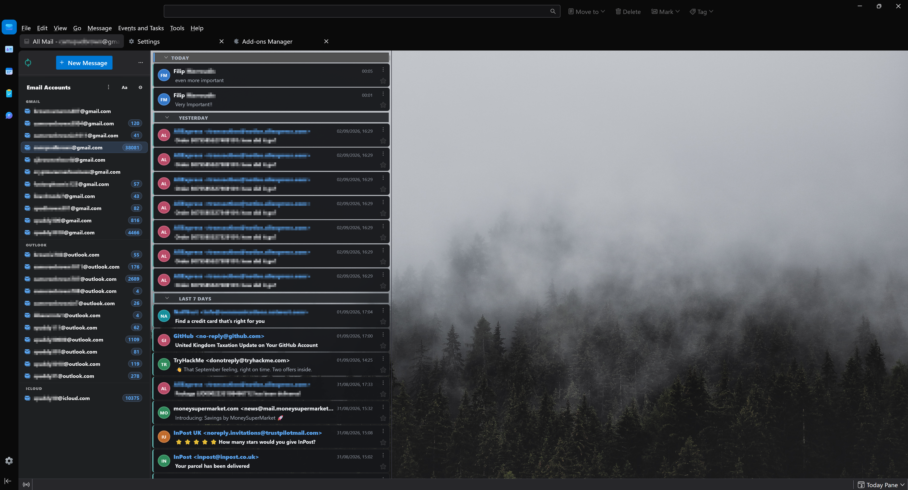
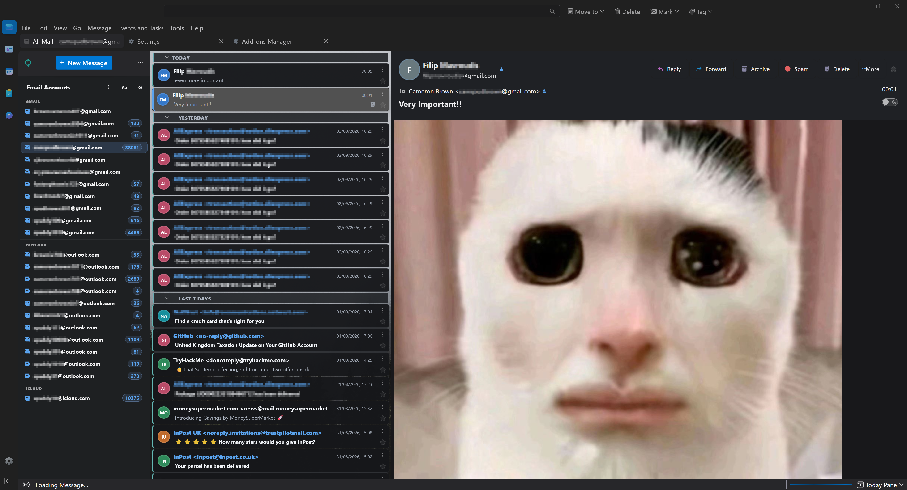

# FluentBird Polished for Thunderbird

An Outlook-inspired visual overhaul for Thunderbird with modern message cards, sender avatars, quick account switching, a one-click delete action, and a customisable wallpaper.

## What's included

- **Polished message cards** with clearer spacing, rounded surfaces, sender and subject hierarchy, improved unread highlighting, and tidy date, star, attachment, menu, and delete controls.
- **Colour-coded sender initials** beside every message, similar to Outlook and Gmail.
- **One-click delete** on each message row without removing Thunderbird's normal favourite star.
- **Email Accounts switcher** that opens each account's All Mail folder, or Inbox when All Mail is unavailable, without expanding or scrolling the normal folder tree.
- **Flexible account organisation** with automatic provider groups, custom headers, a flat ungrouped mode, drag-and-drop ordering, hidden accounts, and persistent settings.
- **Optional live unread badges** using the same rounded appearance as Thunderbird's native folder counts.
- **Independent account-list sizing** using the `Aa` button to cycle through Compact, Comfortable, and Spacious layouts.
- **Automatic date groups** so Today, Yesterday, Last 7 Days, and similar sections open when the mail view loads.
- **Scroll-position preservation** so opening a message does not pull it into the centre of the list.
- **Custom wallpaper and Windows 11 Mica support**, plus refined light, dark, narrow-window, keyboard-focus, and reduced-motion styling.

The account switcher recognises Gmail, Outlook/Hotmail, iCloud, Yahoo, Proton Mail, AOL, Zoho Mail, Fastmail, GMX, Mail.com, Yandex, and Tuta. Other and custom domains automatically receive a group based on their domain. You can also create your own headers, such as Work or Personal, and assign any account to them.

## Requirements

- **Thunderbird 140 or newer** using Card View.
- `toolkit.legacyUserProfileCustomizations.stylesheets` enabled for the CSS theme.
- Windows 10/11 is recommended. Mica is Windows 11-only, but most styling works on other platforms.

## Installation

### 1. Download the release

Download `FluentBird-Polished-3.3.3.zip` from the [latest release](../../releases/latest) and extract it.

The archive contains:

- `chrome/` — the theme, icons, and wallpaper.
- `polished-ui.xpi` — sender avatars, quick delete, date-group defaults, scroll fixes, and the account switcher.
- `POLISHED-README.md` — an offline copy of the installation notes.

### 2. Install the CSS theme

1. Open Thunderbird and go to **Help → Troubleshooting Information**.
2. Next to **Profile Folder**, select **Open Folder**.
3. Close Thunderbird completely.
4. Back up any existing `chrome` folder if it contains your own customisations.
5. Copy the extracted `chrome` folder into the profile folder, replacing the previous FluentBird files when upgrading.
6. Start Thunderbird and open **Settings → General → Config Editor**.
7. Set `toolkit.legacyUserProfileCustomizations.stylesheets` to `true`.
8. Restart Thunderbird.

Set Thunderbird's built-in theme to **System Theme** so it does not conflict with FluentBird.

### 3. Install the FluentBird add-on

1. Remove or disable the old **Sender Avatars** and **Trash Button** add-ons if you used version 1.0.
2. Open **Tools → Add-ons and Themes → Extensions**.
3. Select the gear menu and choose **Install Add-on From File…**.
4. Select `polished-ui.xpi` from the extracted release.
5. Accept Thunderbird's full-access prompt and restart Thunderbird.

The add-on uses a Thunderbird Experiment API because the required Thunderbird interface elements are not exposed through standard extension APIs. It works locally, makes no network requests, and does not read message bodies.

If Thunderbird blocks installation, open the Config Editor and confirm `extensions.experiments.enabled` is `true`. Unsigned local builds may also require `xpinstall.signatures.required` to be `false`; only change that setting if you understand the security implications and obtained the XPI from this repository.

### 4. Match the screenshot layout

Enable Thunderbird's **Card View** and group the message list by date if you want the Today, Yesterday, and Last 7 Days headings shown in the screenshots.

## Using the account switcher

- Click an email address to open All Mail, with Inbox used as a fallback.
- Drag an account to reorder it within its group.
- Drag a provider or custom heading to reorder entire groups.
- Press **Aa** to change only the account-list size.
- Press the settings button beside **Email Accounts** to control grouping, unread badges, account visibility, custom headers, the All Folders section, and header buttons.
- If you hide the header buttons, right-click **Email Accounts** to reopen its options.

All choices persist across Thunderbird restarts. **Reset custom order** restores the automatic provider/alphabetical order.

## Customising the wallpaper

Replace `chrome/wallpaper.jpg` with your own image using exactly the same filename. A high-resolution or 4K image is recommended.

## Upgrading from version 1.0

1. Back up your current Thunderbird `chrome` folder.
2. Replace it with the `chrome` folder from the 3.3.3 release.
3. Disable or remove the original `sender-avatars.xpi` and `trash-button.xpi` add-ons.
4. Install `polished-ui.xpi`.
5. Restart Thunderbird.

The original release remains available as [version 1.0](../../releases/tag/v1.0), including its two separate add-ons and original theme files.

## Uninstalling

- **Theme:** remove the FluentBird files from your profile's `chrome` folder and restart Thunderbird.
- **Add-on:** open Add-ons and Themes, find **FluentBird Polished UI**, and select **Remove**.

## Known limitations

- Designed around Thunderbird 140+ Card View; future Thunderbird interface changes may require updates.
- Windows 11 Mica does not work on other operating systems.
- Compose, Settings, Calendar, Tasks, Chat, and some Shadow DOM surfaces have more limited theme coverage.
- The account switcher uses Thunderbird's English folder name `All Mail` and falls back to Inbox when it cannot find it.

## Changelog

See [CHANGELOG.md](CHANGELOG.md) for the main differences between the original release and FluentBird Polished.

## Credits and licence

Titlebar icons are based on the [FluentBird](https://www.dannyking.co.uk) project by Danny King.

Fluent Design icons are provided by Microsoft under the MIT License. FluentBird Polished is also distributed under the [MIT License](LICENSE).
